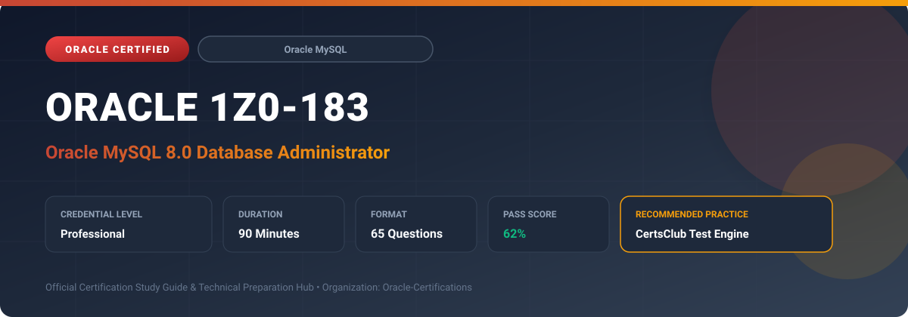

  

# Oracle 1Z0-183: Oracle MySQL 8.0 Database Administrator

---

## 1. Exam Overview & Candidate Profile

The **Oracle 1Z0-183: Oracle MySQL 8.0 Database Administrator** credential certifies professionals who demonstrate technical mastery, architectural competence, and hands-on operational capability in this certification domain.

Candidates validate comprehensive knowledge and expertise required to design, configure, manage, and optimize mission-critical Oracle environments across cloud, on-premises, and hybrid architectures.

### Target Audience & Prerequisites
- **Target Roles**: Implementation Specialists, Cloud Architects, Technical Leads, Enterprise Consultants, and Systems Engineers.
- **Recommended Experience**: 1–2 years of practical, hands-on experience designing, implementing, and maintaining corresponding Oracle solutions.
- **Credential Earned**: Professional Certification.

---

## 2. Key Exam Specifications

| Specification | Details |
| :--- | :--- |
| **Exam Code** | **Oracle 1Z0-183** |
| **Official Title** | Oracle MySQL 8.0 Database Administrator |
| **Certification Track** | Oracle MySQL |
| **Exam Duration** | 90 Minutes |
| **Number of Questions** | 65 Questions |
| **Passing Score** | 62% |
| **Question Format** | Multiple Choice (Single/Multiple Answer), Scenario-Based Questions |
| **Delivery Provider** | Oracle University / Pearson VUE (Online Proctored or Test Center) |
| **Recommended Practice Engine** | [CertsClub Oracle Practice Tests](https://www.certsclub.com/oracle/1z0-183-dumps.html) |

---

## 3. Official Blueprint & Exam Domain Breakdown

The examination assesses candidate competencies across core functional domains weighted as follows:

| Domain Area | Weighting |
| :--- | :--- |
| **Server Installation, System Architecture & Configuration** | `20%` |
| **User Security, Privileges, Roles & SSL/TLS Encryption** | `20%` |
| **Backup, Point-in-Time Recovery & Enterprise Backup** | `20%` |
| **InnoDB Storage Engine Internals & Memory Tuning** | `20%` |
| **High Availability: Replication, Group Replication & InnoDB Cluster** | `20%` |

---

## 4. Deep Dive into Complex & Challenging Technical Topics

To secure a passing score on the 1Z0-183 exam, candidates must master the following advanced concepts:

- Configuring and tuning the MySQL 8.0 data directory, system variables (my.cnf), and dynamic variables via `SET PERSIST`.
- Implementing role-based privilege management, password validation plugins, account locking, and encrypted client connections.
- Tuning InnoDB internals: buffer pool sizing, redo log capacity, doublewrite buffer, undo tablespaces, and adaptive hash indexes.
- Executing physical online backups using MySQL Enterprise Backup and logical dumps using mysqldump / MySQL Shell dump utility.
- Architecting resilient high availability using MySQL Group Replication, Multi-Source replication, and MySQL InnoDB Cluster with MySQL Router.

---

## 5. Scenario-Based Demo & Practice Questions

### Question 1
Which MySQL 8.0 SQL syntax modifies a system configuration variable and automatically saves the new setting to mysqld-auto.cnf across server restarts?

A) SET PERSIST variable_name = value;
B) ALTER SYSTEM SET variable_name = value;
C) UPDATE mysql.settings SET value = ...;
D) WRITE TO CONFIG variable_name = value;

- **Correct Answer**: `A) SET PERSIST variable_name = value;`  
- **Technical Explanation**: `SET PERSIST` updates the runtime global variable and persists the change to `mysqld-auto.cnf`, ensuring the configuration survives subsequent server restarts without manual config file edits.

---

### Question 2
What component in MySQL InnoDB Cluster acts as a lightweight middleware proxy, routing client connections transparently to the active primary or read-only secondaries?

A) MySQL Router
B) Apache Web Server
C) Ksplice Kernel Daemon
D) NDB Cluster Arbiter

- **Correct Answer**: `A) MySQL Router`  
- **Technical Explanation**: MySQL Router is the intelligent routing layer in an InnoDB Cluster that routes client read/write traffic to the primary node and read traffic across secondary nodes.

---

## 6. Recommended Preparation Strategy & Practice Testing Engine

Achieving certification in **Oracle 1Z0-183** requires balanced theoretical study and scenario-based simulation practice:

1. **Review Oracle Documentation**: Master architecture guides, implementation workbooks, and administration manuals on the Oracle Help Center.
2. **Hands-on Lab Practice**: Execute real-world configuration, policy setup, and troubleshooting tasks in your cloud tenancy or test instance.
3. **Simulated Exam Drills**: Practice answering timed, scenario-based multiple-choice questions to familiarize yourself with the question formats, traps, and timing constraints.

### Practice With CertsClub
For realistic practice questions, updated dumps, and mock testing environments:
- **Resource**: [CertsClub Oracle Practice Test Engine](https://www.certsclub.com/oracle/1z0-183-dumps.html)
- **Special Discount**: Use coupon code **`club20`** during checkout for an instant **20% discount** on all practice exam bundles and testing engines.

---

## 7. Official Documentation & References

- [Oracle University Certification Registry](https://education.oracle.com/)
- [Oracle Help Center Documentation Portal](https://docs.oracle.com/)
- [Oracle Cloud Infrastructure & Applications Guides](https://docs.oracle.com/en/cloud/)
- [CertsClub Oracle Certification Exam Practice](https://www.certsclub.com/oracle/1z0-183-dumps.html)

---

## 8. SEO & Discovery Keywords

`oracle 1z0-183, oracle 1z0-183 exam, oracle 1z0-183 dumps, 1Z0-183 practice questions, 1Z0-183 study guide, mysql 8.0 database administrator, certsclub 1z0-183`